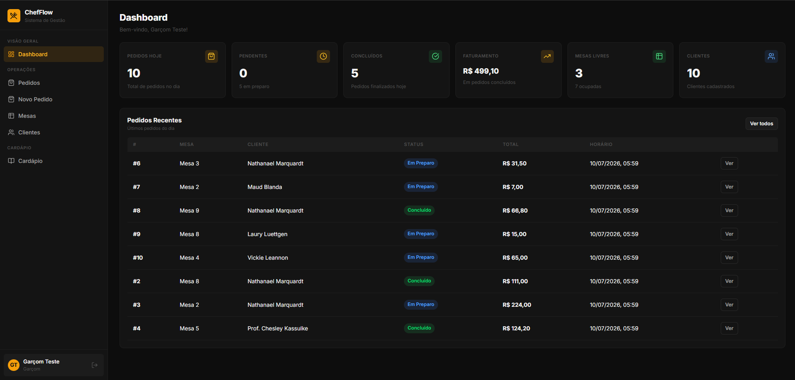
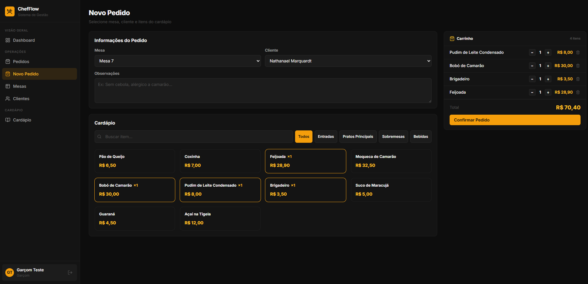
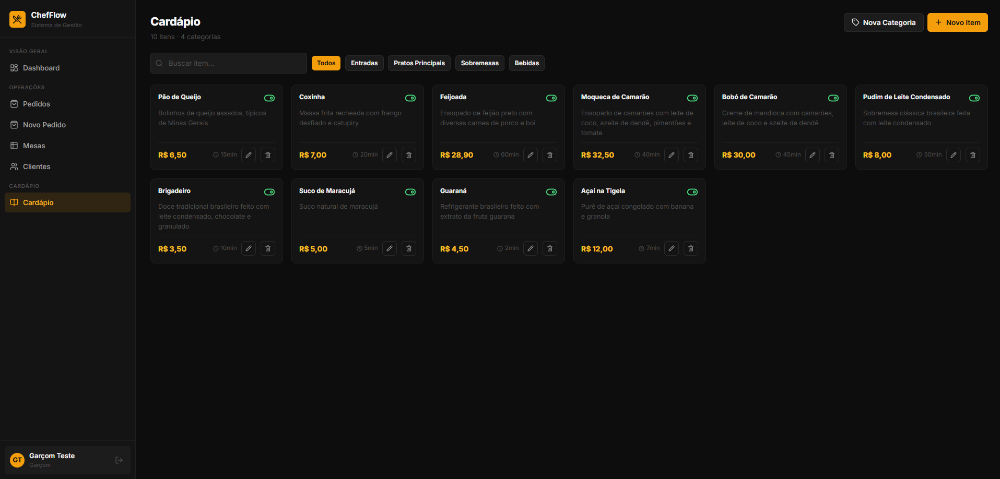

# Sistema de Gestão para Restaurantes

ChefFlow é um sistema de gestão para gerenciar operações de restaurante, como autenticação de funcionários, cardápio, mesas, clientes e pedidos





---

## Funcionalidades Principais

### Painel do Garçom
- **Dashboard Operacional**: Resumo de pedidos diários, faturamento, mesas livres e clientes.
- **Gerenciamento de Mesas**: Monitoramento e alteração de status (`Livre` / `Ocupada`).
- **Gerenciamento de Clientes**: Cadastro rápido e consulta utilizando CPF.
- **Cardápio**: Edição e controle de disponibilidade de itens diretamente na interface.
- **Pedidos**: Criação de pedidos via carrinho de compras, atrelando mesa e cliente.

### Painel da Cozinha / Cozinheiro
- **Painel Horizontal KDS (Kitchen Display System)**: Visualização dos pedidos:
  - **Em Preparo**: Pedidos em andamento na cozinha.
  - **A Fazer**: Fila de novos pedidos aguardando início.
- **Controle de Status**: Alteração rápida para *Em Preparo* ou *Concluído* em um clique.

### Navegação e Caching
- **Stale-While-Revalidate**: Navegação instantânea e fluida em toda a aplicação. O conteúdo em cache é exibido de imediato, enquanto uma requisição em segundo plano atualiza a tela silenciosamente caso haja novidades.

---

## Tecnologias Utilizadas

### Backend
- Laravel 12 & PHP 8.4
- PostgreSQL
- Docker & Docker Compose
- Laravel Sanctum

### Frontend
- React 19 & TypeScript
- Vite
- Tailwind CSS v4
- Axios

---

## Instalação e Execução

1. **Configurar Ambiente:**
   Crie o arquivo `.env` a partir do arquivo de exemplo:
   ```bash
   cp .env.example .env
   ```

2. **Subir os containers:**
    Inicie a stack de containers (Nginx, PHP-FPM, PostgreSQL e Redis):
   ```bash
   docker compose up -d --build
   ```

A aplicação estará disponível para acesso em: **`http://localhost:8000`** (ou na porta correspondente configurada no seu `.env`).

---

## Credenciais de Acesso (Teste)

| Papel | E-mail | Senha |
|---|---|---|
| **Garçom** | `garcom@restaurant.com` | `password` |
| **Cozinheiro** | `cozinheiro@restaurant.com` | `password` |
